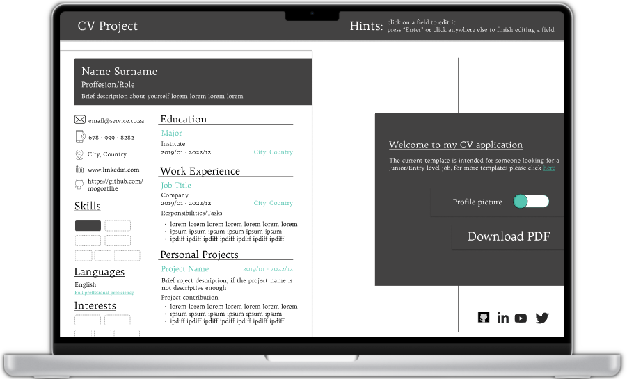

# CV PROJECT

#### A CV creation website to help practice ReactJS

## Core Requirements

- [ ] Add a section for general information like name, email, phone number.
- [ ] Add a section for educational experience (school name, title of study, date of study)
- [ ] Add a section for work experience (company name, position title, main tasks of your jobs, date from and until when you worked for that company)
- [ ] Add an edit button to display the input fields, with the previously displayed information as values.
- [ ] Add a submit button to submit the form and display the value of the input fields in HTML elements.

## Added Features

- [ ] Add a section to allow the user to add/remove a profile picture.
- [ ] Add an option to allow the user to download their CV as a PDF.

## Design

## Installation Instructions

- Clone the repo
- Open the `cv-project` folder
- Run `npm start` from your terminal
  - If your browser does not open automatically paste `http://localhost:3000` in the address bar of your browser and press `Enter`
